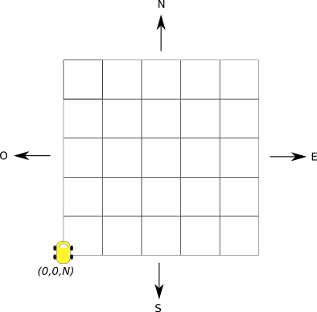

% Martian Robots
% Arnaud Bailly - Cédric Pineau
% 2012/11/15

# Introduction 

A squadron of robots is sent to Mars by the European Spatial Agency
(ESA) in order to prepare for human colonization. The robots are
expected to land on a rectangular plateau located on the footstep of Mount
Olympus which is void of hard obstacles and perfectly suited for
further establishment of a human-populated basecamp.

As the robots shall mostly work in autonomy using some programmed
behaviour, your mission, should you accept it, is to write a program
that will allow ESA scientists to _simulate_ the moves and actions of
these robots on Mars.

# Requirements

## Robots 

A robot is caracterized by:

* A position `(x,y)` within the coordinate system of the
  plateau. `(0,0)` is the southwest corner, coordinates are always
  integral and represent meters,
* A heading which is one of `N(orth),W(est),S(outh),E(ast)`,
* A battery level which is a floating point value between 0
  and 100

## Plateau

The plateau on which the robots shall work is not totally flat: To
each coordinate location is assigned an altitude which is a positive
integer between 0 and 10. For the purpose of the simulation, the size
and characteristics of the plateau may evolve but it shall never be
greater than 10 x 10 kilometers. 

The plateau contains a "base camp", actually an solar powered plant
into which robots can tap to refill their battery. This base camp is
considered to occupy a  1 sq.m. space on the plateau.

## Movement Rules

### Constraints

* The simulation evolves in steps of 1 second interval,
* A robot explodes when it goes outside of the boundaries of the plateau
* A robot which moves into the same position as another robot is
  destroyed along with the robot it collided with
* A robot can act as long as its battery level is greater than 0. When
  this level reaches 0 (or below), any remaining orders are ignored by
  the robot
* A robot consumes energy which is drawn from its battery according to
  the following formula, where $h_n$ and $h_{n+1}$ stand for the start
  and end height respectively and $G$ for Mars' gravitational constant
  which is 3.7:
  
     $$((h_{n+1} - h_{n})/h_{n+1} + 1) * G$$
  
* A robot cannot move when the height difference between its source
  and destination is greater than 2 meters.        
* When not moving, robot does not consume battery power

### Orders & Rules

A robot acts according to a *program* which consists in a sequence of
orders represented by a single letter:

* `M`: move one meter in the direction the robot is currently heading to
* `L`: Turn π/2 radians to the left
* `R`: Turn π/2 radians to the right
* `0`: Do nothing

Each order may (optionally) be prefixed by a number (greater than 0)
of time steps to wait *before* the following order is executed by the
robot. 

## The Simulation Program

The simulation is a simple command-line oriented program that takes as
input a simulation description, runs the simulation and outputs the
final position of the robots.

### Input 

The input to the simulation is a line-oriented plain-text file. Each
line has a different meaning and elements within a line are separated
by one or more spaces:

* *Line 1*: The width and height of the plateau
* *line 2*: Number of cells whose height is different from 0
* *line 3-n*: Coordinates and height of the _(n-2) cells_ on the plateau whose
   height is different from 0
* *line 4*: Number of robots
* *line 5-m*: Initial coordinates and bearing for each robot. The
   initial energy of each robot is 100
* *remaining lines*: Orders for robots structured as a numeric id
   identifying a robot and a sequence of digits and letters
   representing orders as defined in the preceding section
   
Here is an example valid input file:

    5 5
    1
    2 2 3
    2
    1 2 N
    3 3 E
    1 L1M4LM1LMLMM
    2 M12MR1MMRM4R000RM

The size of the plateau is 5x5, it has one cell whose height is
different from 1, two robots with given initial positions and
headings. Each robot is given a single sequence of orders.

### Run

The simulation runs by executing the orders provided for each
robot until the sequence runs out of orders to execute. This execution
is expected to be *concurrent*: Orders for each robot 
are executed in parallel at each *tick* of the simulation. Of course,
it is perfectly admissible for the simulation to *not be
multithreaded* as long as the semantics of parallel execution is
maintained. 

What this means concretely is that the following simulation:

    4 4 
    0
    2 
    0 0 N
    1 0 N
    1 M1M
    2 MLM
    
 should output the following final positions:
 
    1 0 2 N 98
    2 1 0 W 97
    
whereas the following simulation:

    4 4 
    0
    2 
    0 0 N
    1 0 N
    1 M2M
    2 MLM

should output nothing: The two robots have exploded in a collision at
cell (0,1).

### Output

Once completed, the simulation outputs a text representing the final
position and bearing of each surviving robot. Each line of this text
has the following structure:

* Numeric id of the robot
* Position in X,Y coordinates of the robot
* Bearing of the robot
* Remaining battery level

# Assignment

Fortunately (!) you do not have to start writing your simulation
program from scratch: An intern that has now left the ESA has written
first version of the simulation in Java which hopefully does part of
the job. 

Unfortunately, it is not clear what are the implemented features of the
simulation, but it is sure that energy consumption was not
implemented. 

## Goal

Your task will then consist in completing the simulation
program with missing features and improve the current design of the
sytem. To sum-up, are here the goals of this exercise:

* Improve the design of the current codebase by applying functional
  concepts and patterns
* Implement correctly the above specification. There should of course
  be (automated) tests to demonstrate the correct behaviour of this
  specification

## Hints

Here is a list of *hotspots*, methods and classes whose design could
benefit from applying functional principles and patterns. This list is
of course non exhaustive...

* `Simulation.run()`: Separate I/O actions from orders' execution
  (*purity*)
* `Simulation.routine()`: Robot's position are updated then
  potentially rollbacked if they conflict (*immutability*)
* `Simulation.routine()`: One can compose different levels of
  execution for orders (*expressivity*, *composability*), Various
  patterns can apply here such *Closure of Operations*:
    * Execute 1 order for 1 robot
    * Execute n orders for 1 robot
    * Execute n orders for m robots
  
* `Simulation.initXXX()`: Initialisation of objects is complex and
  error-prone, one can use Builder pattern to siplify logic-checking
  (*immutability*, *expressivity*)
* `Simulation.initXXX()`: Separate verification logic from objects'
  construction, using for example `filter()` higher-order function on
  input lists (*expressivity*, *purity*)
* `Saver.askFileNameText()`: Separate I/O from interaction logic and
  verification to provide better testability (*purity*) 
* `Batterie`: Energy consumption logic should preserve objects'
  immutability yet be practical. *Closure of operations* might be a
  good candidate (*immutability*) 
* `Main.gestionLigneCmd()` (not for the faint of heart!): Need
  complete rewrite.
