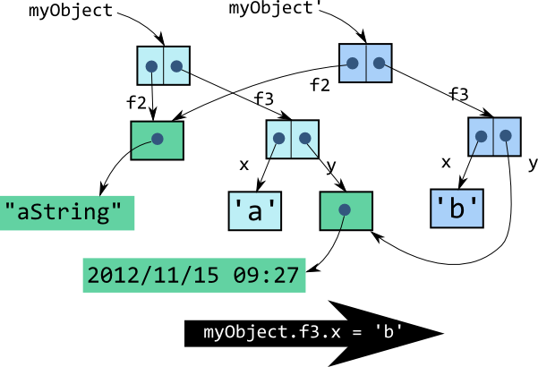

% Functional Programming for Simpler Design
% Arnaud Bailly - Cédric Pineau
% 2012-11

# Simple Design

## Ce qui se conçoit bien...

## Roots of Agile

* http://agilemanifesto.org

    > Simplicity - the art of maximizing the amount
    > of work not done - is essential. 
    
* **Simple Design**: One of the 12 core practices of eXtremeProgramming

## What XP Says

* Runs all the tests.
 
    > Easily Testable

* Expresses every idea that we need to express.

    > Expressive, Legible

* Says everything Once And Only Once.

    > Concise

* Has no superfluous parts

    > Precise

## Yet Another Definition

* Runs all the tests.
* Maximizes Cohesion
* Minimizes Coupling
* Says everything Once And Only Once

## Which Tools Do We Have?

* IDEs and Development Tools
* Frameworks
* Design Patterns
* Programming Languages
* Programming Paradigms

## Imperative vs. Declarative

Two Main Paradigms:

* **Imperative** (object-oriented, structured programming, parallel programming): Express directly the operations modifying the state of the world
* **Declarative** (*functional*, logic, data-flow): Expresses the *expected result* and let the runtime system produce it

## And the Winner Is...

The **Imperative Programming Model!**

* Appears more "obvious", more immediate, one directly "talks to the machine"
* Declarative programming tools are reserved for math-savvy nerds toying with abstract non-sense (read: Category theory, non-standard logic...)

## But, but, but

* *Functional programming* is not incompatible with OO concepts
* Imperative programming did not deliver on all its promises: Concurrency? Maintenance? Abstraction? Reuse?

## The Future is Functional

For all these reasons, tomorrow you will be using a functional language

Scala, Haskell, Erlang, Clojure, Groovy, Python, F#...

## The Future is Functional

For all these reasons, tomorrow you will be using a functional language

Scala, Haskell, Erlang, Clojure, Groovy, Python, F#...

## No, The Future is...

Java, C#, PHP, C++...

## But Differently!

* In the Java World: Java8 & JSR-355 (Lambda Expressions for the JavaTM Programming Language)

# Purity

## Living Your Dreams

## Mathematical Functions

More precisely, *total functions* in the mathematical sense of a relationship between 2 sets:

* Each element of the *domain* set has one and only one image in the *range* set
* This image is dependent of the input only
* Such functions are called **pure**

## Why?

* Makes your life easier: No hidden variables, no side-effects
* Makes your code more **testable**
* Provides **idempotency**: Function can be evaluated more than once
* Makes **laziness** possible: Function can be evaluated only when really needed

## An impure "function"

~~~~~~~~~ {.java }
public class DateUtils {

  private HolidaysDAO holidaysDao;
  
  /**
   * This function is not pure:
   *  - It uses a side-effect to compute its result
   */
  public Date nextOpenDay(Date startDate) {
     Date result = null;
     List<Date> holidays = holidaysDao.getHolidays(startDate);
     // some length computation
     return result;
  }
~~~~~~~~~

## Same function, Side-effect Free

~~~~~~~~~ {.java }
public class DateUtils {

  /**
   * This one is pure, it only depends on its input values.
   */
  public Date nextOpenDay(Date startDate, List<Date> holidays) {
     Date result = null;
     // some length computation
     return result;
  }
}
~~~~~~~~~

## Caveats

What happens if:

* The "function" modifies a Date object in the input list?
* This list is concurrently modified by other computations?
   
# Immutability

## Some Things Are Incorruptible

## Referential Transparency

Once assigned a value, a reference never changes

* Also called **referential transparency**: Using references is *the same* as using values
* This applies to all references, including fields of all objects in an object tree

## Classic Mutable Object...

~~~~~~~~~ {.java }
public class User {
  private String email;
  private String firstName;
  
  public User(String email, String firstName) {
    this.email = email;
    this.firstName = firstName;
  }
  
  public String getEmail() {
    return email;
  }

  public void setEmail(String email) {
    this.email = email;
  }
}
~~~~~~~~~

## ... breaks Referential Transparency

Equality is not preserved which might break containers like Hashmaps.

~~~~~~~~~ {.java }
  @Test
  public void preservesReferentialTransparency () {
     User joe = new User("joe@acme.com","John");
     User joe2 = new User("joe@acme.com","John");
     
     assertThat(joe).isEqualTo(joe2);
     
     joe2.setFirstname("Joe");
     
     assertThat(joe).isNotEqualTo(joe2);
  }
~~~~~~~~~

## Same Object, This Time Immutable

~~~~~~~~~ {.java }
@Immutable
public class User {
  private final String email;
  private final String firstName;
  
  public User(String email, String firstName) {
    this.email = email;
    this.firstName = firstName;
  }
  
  public String getEmail() {
    return email;
  }
}
~~~~~~~~~

## Make Objects Immutable

* Collections can be made immutable:

~~~~~~~~~ {.java }
  Collection<String> names = Collections.unmodifiableList(listOfNames);
~~~~~~~~~

* Create Immutable Data objects with Lombok

~~~~~~~~~ {.java }
@Data
public class User {
  private final String name;
  private final Email email;
}
~~~~~~~~~

## Make Objects Immutable (2)

* Immutable Collections in Guava

~~~~~~~~~ {.java }
List<String> famousSmiths = ImmutableList.builder()
   .add("John Smith")
   .add("Robert Smith")
   .add("Patti Smith")
   .build();
~~~~~~~~~

## Immutability Can Be Efficient
  

# Expressivity

## Choose Your Language

## Everything is a First-Class Value

* Functions are *first-class objects*
* *Generic programming* provides write-once use-anywhere library functions
* *Higher-order functions* can take functions as input and return functions
* Decouple *control flow* from *data structures* from *business rules*

## Simplifying Control Structures

Return all values looked-up in a hashmap using Guava's facilities: 

~~~~~~~~~ {.java }
final Map<String, Object> map = ...
Function<String,Object> lookup = new Function<String,Object() {
   public Object apply(String name) {
     return map.get(name);
   }
}

List<String> names = ...
return Lists.transform(names, lookup);
~~~~~~~~~

# Composability

## Divide Quod Impera

## Composing Functions

* Plain functions can be **composed** provided they have compatible types to produce new functions
    
~~~~~~~~~ {.java }
Function<> asInt = new Function<>() { ... };
Function<> divideBy2 = new Function<>() { ... };

Function<> divideString = Functions.compose(divideBy2, asInt);
~~~~~~~~~

## Composing Functions Over Containers

~~~~~~~~~ {.java }
ListenableFuture<Integer> store = //
    transform( //
        transform( //
            transform( //
                future(loadDocuments(slice, index)), //
                new AsyncFunction<Map<String, Builder>, Map<String, Builder>>() {
                        return future(matchDocuments(input, index));
                }), //
            new AsyncFunction<Map<String, Builder>, Map<String, Builder>>() {
                    return future(classifyDocuments(input));
            }), //
        new AsyncFunction<Map<String, Builder>, Integer>() {
                return future(storeDocuments(input, index));
        });
~~~~~~~~~

## Credits

* [Unicorn](http://www.aznewage.com/unicor1.jpg)
* [Gold](http://www.etftrends.com/wp-content/uploads/2012/01/investing-in-gold.jpg)
* [Babel](http://en.wikipedia.org/wiki/The_Tower_of_Babel_%28Bruegel%29)
* [Lego](http://1.bp.blogspot.com/-Mhb5PF-QDSc/T0YcPZ_EVzI/AAAAAAAAFxo/FjJcHYw9wo0/s1600/Lego.jpg)
